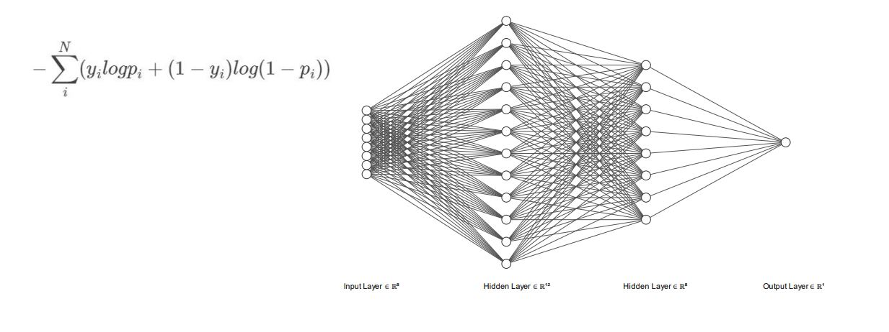
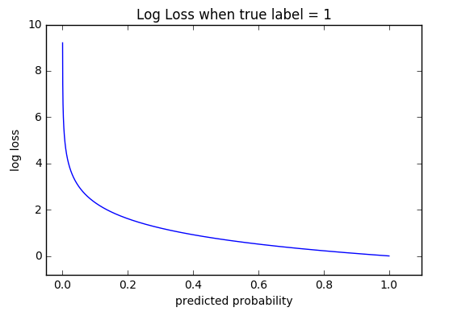

# Diabetes Detector

* Autor: Jesús Ramseths

### Data description

This dataset is originally from the National Institute of Diabetes and Digestive and Kidney Diseases. The objective of the dataset is to diagnostically predict whether or not a patient has diabetes, based on certain diagnostic measurements included in the dataset. Several constraints were placed on the selection of these instances from a larger database. In particular, all patients here are females at least 21 years old of Pima Indian heritage.

### Artificial Neural Network Characteristicss

The artificial neural network has an input layer of 8 neurons that connects to a hidden layer of 12 neurons, then another hidden layer of 8 neurons and finally an output layer with one neuron to classify the patient. Each hidden layer has ReLu activation function and the output layer has sigmoid function.

   

### Cross-Entropy

Cross-entropy loss, or log loss, measures the performance of a classification model whose output is a probability value between 0 and 1. Cross-entropy loss increases as the predicted probability diverges from the actual label. So predicting a probability of .012 when the actual observation label is 1 would be bad and result in a high loss value. A perfect model would have a log loss of 0.

   

- [Database](https://www.kaggle.com/uciml/pima-indians-diabetes-database)
